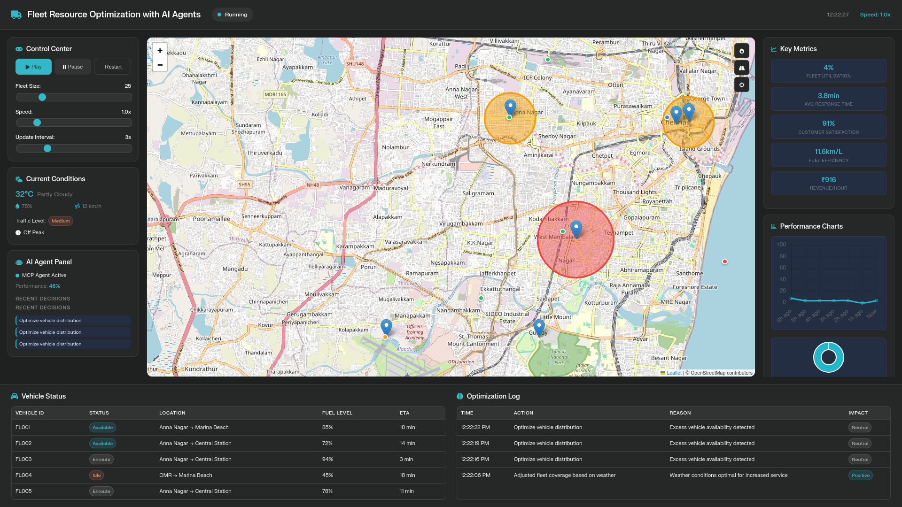

# Fleet Resource Optimization with AI Agents

 

A real-time dashboard simulation that demonstrates how AI agents can dynamically reallocate fleet vehicles based on live traffic, weather conditions, and fluctuating demand zones. This project visualizes logistics optimization within the city of Chennai.

## 📋 Problem Statement

Traditional fleet management often relies on static scheduling, leading to inefficiencies when facing unpredictable real-world variables. This project addresses the need for **AI-driven dynamic reallocation** to:
* Minimize vehicle idle time.
* Respond instantly to high-demand zones.
* Adapt routes based on traffic congestion and weather patterns.
* Optimize fuel efficiency and revenue per hour.

## ✨ Key Features

* **Interactive Map Interface:**
    * Built with **Leaflet.js**.
    * Visualizes vehicle movements, demand zones (heat circles), and key landmarks.
    * Real-time vehicle tracking with status indicators (Available, Occupied, En Route, Idle).
* **AI Agent Simulation:**
    * An internal `AIAgent` class mimics decision-making logic.
    * Automatically triggers reallocation actions (e.g., "Reroute to avoid congestion", "Shift to high demand").
    * Maintains a log of optimization decisions and their impact.
* **Dynamic Environment Simulation:**
    * **Traffic:** Simulates changing congestion levels (Low/Medium/High) affecting ETA.
    * **Weather:** Updates temperature, humidity, and conditions affecting fleet logic.
    * **Demand:** Simulates rush hour surges in specific geographic zones.
* **Live Analytics Dashboard:**
    * **Chart.js** integration for real-time Fleet Utilization and Demand Distribution graphs.
    * Key Performance Indicators (KPIs) for Fuel Efficiency, Customer Satisfaction, and Revenue.
* **Simulation Controls:**
    * Play/Pause/Restart functionality.
    * Adjustable simulation speed (0.5x to 5x).
    * Dynamic fleet sizing (scale from 10 to 100 vehicles).

## 🛠️ Tech Stack

* **Frontend:** HTML5, CSS3 (Custom Design System with CSS Variables).
* **Logic:** Vanilla JavaScript (ES6+ Classes).
* **Libraries (via CDN):**
    * [Leaflet.js](https://leafletjs.com/) - Interactive Maps.
    * [Chart.js](https://www.chartjs.org/) - Data Visualization.
    * [FontAwesome](https://fontawesome.com/) - UI Icons.

## 🚀 Getting Started

Since this is a client-side static application, no backend server or package installation is required.

1.  **Clone the repository** (or download the files):
    ```bash
    git clone https://github.com/rohanroy8/FleetReallocation.git
    ```
2.  **Navigate to the folder:**
    Ensure `index.html`, `style.css`, and `app.js` are in the same directory.
3.  **Run the Application:**
    * Simply open `index.html` in any modern web browser (Chrome, Firefox, Edge).
    * *Note: An internet connection is required to load the Map tiles (OpenStreetMap) and CDN libraries.*

## 🧠 How the Simulation Works

The application runs on a continuous loop.
1.  **Initialization:** Loads the map centered on Chennai, generates a random fleet within lat/long bounds, and defines demand zones.
2.  **The Loop:**
    * **Movement:** Vehicles move incrementally toward their destinations.
    * **Environment:** Weather and traffic variables shift randomly or based on "time of day" logic.
    * **Decision:** The `AIAgent` analyzes the state every 15 seconds (simulation time). If `High Demand Zones > 2` and `Available Vehicles < 5`, it logs a reallocation decision.
3.  **Visualization:** The DOM updates charts, tables, and map markers immediately to reflect the new state.

## 📸 Screenshots



## 🔮 Future Improvements

* **Pathfinding:** Implement actual routing APIs (like OSRM) instead of straight-line movement.
* **Backend Integration:** Connect to a Python/Flask backend to run actual Machine Learning models for demand prediction.
* **History Replay:** Ability to save a simulation run and replay it to analyze AI decisions.

## 📄 License

This project is open-source and available under the [MIT License](LICENSE).
